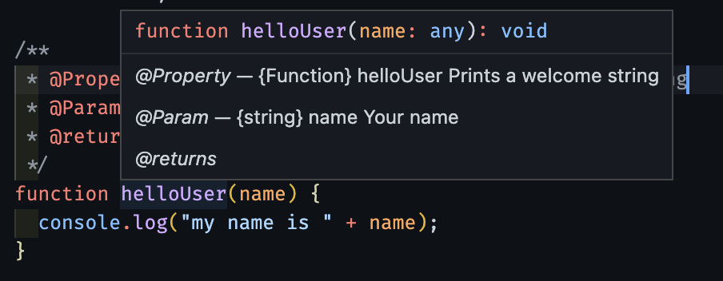

# JavaScript Best Practices

- [JavaScript Best Practices](#javascript-best-practices)
  - [JavaScript Typing](#javascript-typing)
  - [Naming Variables](#naming-variables)
  - [Naming Classes](#naming-classes)
  - [Other Naming Rules](#other-naming-rules)

## JavaScript Typing

In coding languages we use primitive types which are immutable; meaning they are not able to be changed, and objects which are not considered primitive.

We use primitive types and data structures together to build some complex logic.

Primitive Types:

```JavaScript
const a = "String" // String
const b = 123 // Number
const c = 12.23 // Also a Number type
const d = true // Boolean
const e = false // other Boolean value
const f = null // Null
const g = undefined // Undefined
```

## Naming Variables

In JavaScript we use `Camel Casing` for most variable naming:

1. No spaces
2. The first word is lowercase and each word following that begins with an uppercase letter

```JavaScript
const fullName = "Jane Doe";
const age = 31;
const isTrue = true;
const generatePassword = function(){...};
const anotherFunction = () => {...};
function oneMoreFunction(){...};
```

## Naming Classes

Other than camel casing we use `Pascal Casing` specifically for classes:

1. No spaces
2. Every word in the variable name starts with a capital letter

```JavaScript
class Car {...}
class AnotherClass {...}
class OneMoreClass {...}
class LongerClassName {...}
```

## Other Naming Rules

Here are some general rules to follow when creating variable names in JavaScript. We don't have to follow these rules, but each language has its own set of agreed-upon standards to make it easier for JavaScript developers to understand each other's code.

1. Keep names short
2. Write descriptive names
3. When initializing functions it's good practice to write a special kind of comment that describes the function. Below are two examples.

this special comment is helpful because it allows developers to read at a glance what a function is for, and if it has any parameters, what they represent.

```JavaScript
/**
 * Prints the string "Hello World" to the console
 */
function helloWorld() {
  console.log("Hello World");
}
```

```JavaScript
/**
 * @Property {Function} helloUser Prints a welcome string
 * @Param {string} name Your name
 * @returns {void}
 */
function helloUser(name) {
  console.log("my name is " + name);
}
```

When we describe a function with this special comment we can hover over the function and get a code snippet like the image below:

allows us to at a glance understand what a function is for, this comes in very handy with more complex functions, or when learning to use a new framework
